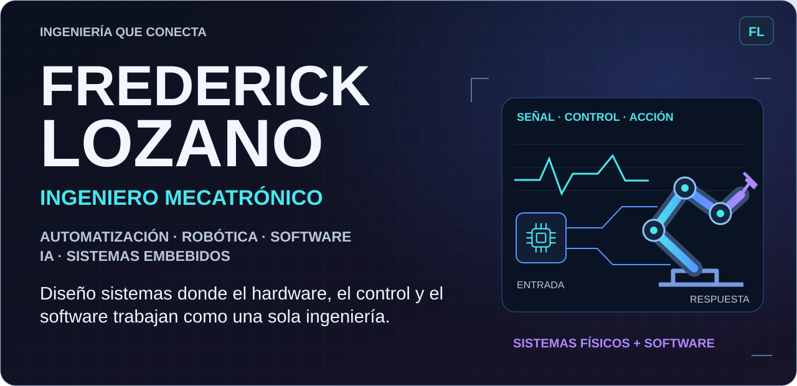
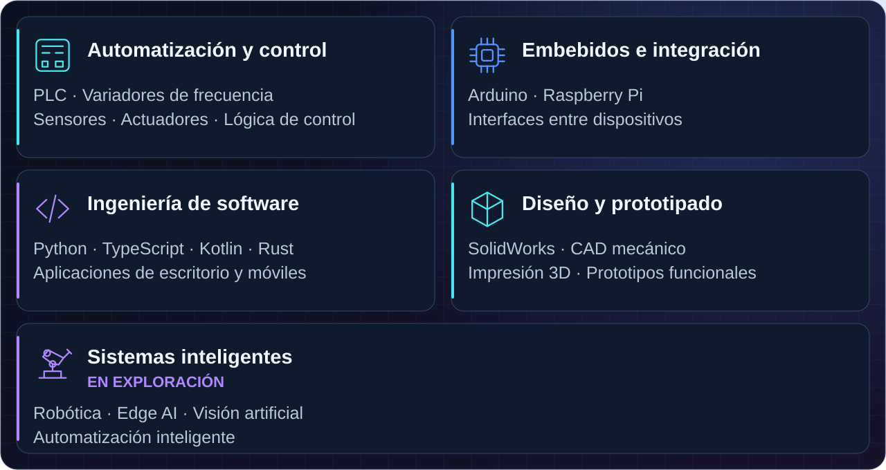
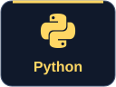
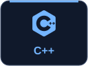
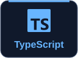
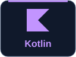
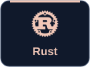
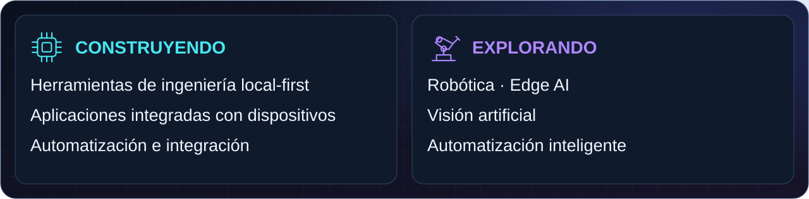
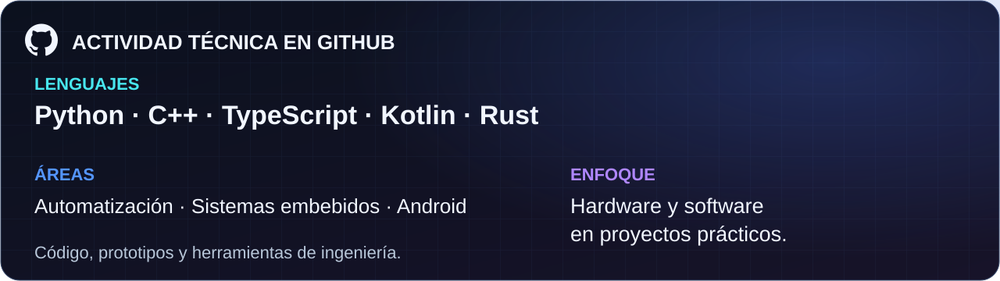

<picture>
  <source media="(max-width: 600px)" srcset="./assets/profile-hero-v3-mobile.svg">
  
</picture>

**Frederick Lozano Torres** · Ingeniero Mecatrónico · Bogotá, Colombia

Construyo desde la mecatrónica: el comportamiento físico, los sensores, los actuadores y la lógica de control dan forma al software. Desarrollo soluciones que conectan prototipos embebidos, automatización y aplicaciones de escritorio y móviles.

## ⚙️ Perfil de Ingeniería

<picture>
  <source media="(max-width: 600px)" srcset="./assets/perfil-ingenieria-v3-mobile.svg">
  
</picture>

## 🧰 Tecnologías y Habilidades

### Lenguajes de programación

  
  
  
  
  

### Sistemas embebidos y hardware

  
  
  
  
  

### Automatización

  
  
  

### Desarrollo

  
  
  
  
  
  

### Diseño y prototipado

  
  

## 🚀 Proyectos Destacados

<picture>
  <source media="(max-width: 600px)" srcset="./assets/proyectos-v3-mobile.svg">
  
</picture>

**Base física y embebida:** [ver el código público de Acceso-Controlado ↗](https://github.com/ingelozano/Acceso-Controlado)

## 🎯 En qué estoy trabajando

<picture>
  <source media="(max-width: 600px)" srcset="./assets/enfoque-v3-mobile.svg">
  
</picture>

## 📊 GitHub / Actividad técnica

<picture>
  <source media="(max-width: 600px)" srcset="./assets/actividad-v3-mobile.svg">
  
</picture>

## 🌐 Conectemos

Me interesan equipos y proyectos que conecten automatización, sistemas físicos y software.

  
  

