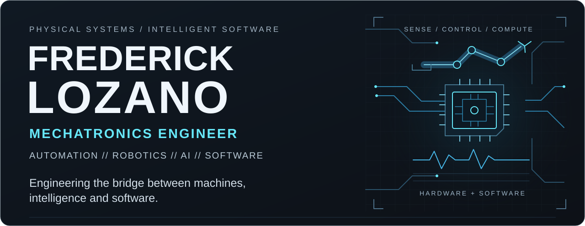

<picture>
  <source media="(max-width: 600px)" srcset="./assets/profile-hero-mobile.svg">
  
</picture>

**Frederick Lozano Torres** · Mechatronics Engineer · Bogotá, Colombia

I build systems that connect physical devices, control and software—from embedded prototypes to desktop and Android applications. My work combines electronics, automation and software engineering, with robotics and AI as areas of ongoing exploration.

## Engineering Profile

- **Industrial & automation** — PLC programming, motor drives and control systems.
- **Embedded & smart systems** — sensor inputs, actuator control, edge computing and home automation.
- **Software engineering** — device inspection tools, native applications and tools for evaluating technical projects.
- **Design & prototyping** — mechanical CAD and 3D printing to connect digital designs with physical prototypes.

## Selected Engineering Work

### [Embedded Access-Control Prototype](https://github.com/ingelozano/Acceso-Controlado)

Keypad input, infrared sensing and timed relay control in one embedded prototype, with an I²C LCD for operator feedback. **Arduino · C++ · I²C**

### Projects in Development

These projects are **Private / Active Development**; summaries describe their purpose without exposing implementation details.

| Project | Engineering focus |
| :--- | :--- |
| **ESCUDO Inspector** | Local device inspection to make security findings easier to understand. Desktop tooling · Rust · TypeScript · Tauri |
| **Garaje Android** | Motorcycle software connecting real-world use with mobile measurement. Android · Kotlin · Jetpack Compose |
| **OpenScout** | Helps identify open-source projects for a technical need. Engineering software tools · TypeScript · Next.js |
| **CreditCoach** | Personal finance software focused on automated recordkeeping and privacy. Android · Kotlin · Jetpack Compose |

## Technical Stack

| Domain | Tools used |
| :--- | :--- |
| **Embedded computing** | Arduino · C++ · Raspberry Pi |
| **Automation & connected systems** | PLC · Variable-frequency drives · Home Assistant |
| **Software** | Python · TypeScript · Kotlin · Rust |
| **Application development** | Android · Jetpack Compose · Tauri · Next.js |
| **Design & fabrication** | SolidWorks · 3D printing |

## Current Focus

**Building:** local-first systems, device inspection and engineering software tools. 
**Exploring:** intelligent automation, robotics, edge AI and computer vision.

## Connect

[GitHub](https://github.com/ingelozano) · [LinkedIn](https://linkedin.com/in/frederick-lozano-torres-76a262286)
